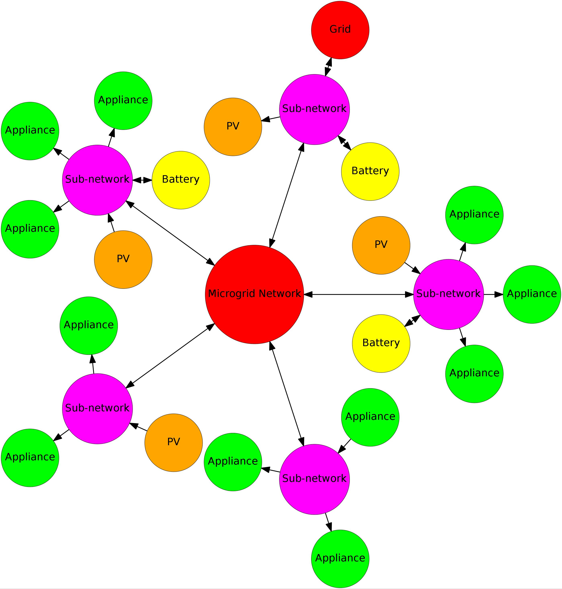

# Device Kit
`device_kit` is a Python package containing a collection of scalar flow "device" models. It defines a common abstract interface for a device and a way of constructing new aggregate devices from collection of related devices. The `device_kit` was originally written for the purpose modeling controllable Microgrid or household electrical devices, and then optimizing flows over a day-ahead time horizon.

In the scope of this package, a device is something that consumes and/or produces some kind of scalar valued commodity (ex. electricity, gas, fluid) over a fixed, discrete, and finite future planning/scheduling horizon (ex. every hour of the next day, or every minute of the next hour, etc). For each device what is modeled is simply:

  1. the constraints on the commodity *flow* to/from the device (hard constraints).
  2. preferences for different feasible states of flow to/from the device (costs or soft constraints).

The device models provided are currently all weakly convex and tunable.

Low level devices exist in a network which acts as a conduit for commodity flow between devices (ex. an electrical bus). This package is limited (by design) to modeling radially structured (in other words, *rooted tree* structured) networks to an arbitrary nesting level (the simple flow networks we were interested have a radial structure or can be treated as such at the level of abstraction we were interested in). "Networks" are simply implemented as composite devices containing other atomic or composite devices, down to some eventual leaf node level (<a href="#f1">figure 1</a>).

---

<table>
  <tr>
    <td width="33%" style="vertical-align: top;">
        <figure>
            <a name='f1'></a><br/>
            <small>DeviceSet allows devices to be connected to represent a radially connected network of devices, such as the Microgrid example shown in the figure. The Microgrid and Sub-Network nodes correspond to DeviceSet instances.</small>
        </figure>
    </td>
    <td width="33%" style="vertical-align: top;">
        <figure>
            <a name='f2'></a><br/>
            <small>The core classes of device_kit. Most the model complexity is in sub classes of `Device`. A few are provided in this package such as `IDevice`. </small>
        </figure>
    </td>
    <td width="33%" style="vertical-align: top;">
        <figure>
            <a name='f2'></a><br/>
            <small>Results.</small>
        </figure>
    </td>
  </tr>
</table>

---

# Synopsis
A simple example of using `device_kit` to model a collection of devices and then solve for some constraint over the joint flows - most commonly balanced flows:

```python
import numpy as np
import pandas as pd
import matplotlib.pyplot as plt
import device_kit
from device_kit import *

def random_uncontrolled():
  return np.maximum(0, 0.5+np.cumsum(np.random.uniform(-1,1, 24)))

def make_model():
  ''' Small power network model. '''
  np.random.seed(19)
  cost = np.stack((np.sin(np.linspace(0, np.pi, 24))*0.5+0.1, np.ones(24)*0.001, np.zeros(24)), axis=1)
  model = DeviceSet('site1', [
      Device('uncontrolled', 24, (random_uncontrolled(),)),
      IDevice2('scalable', 24, (0.5, 2), (0, 24), **{'d0': 0.3}),
      CDevice('shiftable', 24, (0, 2), (12, 24)),
      GDevice('generator', 24, (-10,0), None, **{'cost': cost}),
      DeviceSet('sub-site1', [
          Device('uncontrolled', 24, (random_uncontrolled(),)),
          SDevice('buffer', 24, (-7, 7), **{ 'c1': 1.0, 'capacity': 70, 'sustainment': 1, 'efficiency': 1})
        ],
        sbounds=(0,10) # max capacity constraint.
      ),
    ],
    sbounds=(0,0) # balanced flow constraint.
  )
  return model

def main():
  model = make_model()
  (x, solve_meta) = device_kit.solve(model, p=0) # Convenience convex solver.
  print(solve_meta.message)
  df = pd.DataFrame.from_dict(dict(model.map(x)), orient='index')
  df.loc['total'] = df.sum()
  pd.set_option('display.float_format', lambda v: '%+0.3f' % (v,),)
  print(df.sort_index())
  print('Utility: ', model.u(x, p=0))
  df.transpose().plot(drawstyle='steps', grid=True)
  plt.ylabel('Power (kWh)')
  plt.xlabel('Time (H)')
  plt.savefig('synopsis.png');

if __name__ == '__main__':
  main()

```

# Class Structure
There is two important class, `Device` and `DeviceSet`. The UML class diagram in the figure below shows how they are related. All devices sub-class `BaseDevice` which is the key abstract representation of a device. A device's consumption/production/both (herein called it's *flow*), is a 2D `RxC` numpy array. For "atomic" `Device` class devices `R` is just 1, and `C` is the fixed length (\_\_len\_\_) of the Device. However, a collection of devices is also implemented as a sub-type of `Device` and this is how `R` can be greater than 1. The `DeviceSet` class is used to represent collections of devices, such as a network or sub-network. `DeviceSet` allows devices to be organized into an arbitrarily deep tree of devices. An example is shown in the figure below. Atomic device always occur at the leaves. All internal nodes, and entire tree itself are `DeviceSet` instances.

Note that all devices are intended stateless; they are not actively consuming producing anything. Rather they are modeling the preferences and constraints for the consumption/production/both of a commodity (the `map(flow)` method shown in the UML diagram allows you to map an actual flow matrix onto a collection of devices). Devices are also intended to be immutable (but technically they are not currently strictly immutable).

## Flexibility Modeling Details
Device's encapsulate a flexibility model. Flexibility has two components:

  1. *Preferences* or soft constraints.
  2. *Constraint* or hard constraints.

For convenience, the `Device` base class provides for two very common rudimentary baked-in constraints, `Device.bounds` for *interval* (also called instantaneous) bounds and `Device.cbounds` for *cumulative* bounds.

Preferences are expressed via the `Device.u(flow)` utility function which expresses how much the device "likes" the given state of flow (note that this "utility" function is also used to express how much a producer likes producing a given flow). The Device base class has no preferences; Device.u() just returns 0. It is the main job of a `Device` sub-type to define preferences and/or additional more complex constraints that describe more nuanced device models. sub-types do this by overriding `Device.u()` (preferences) and `Device.constraints` (constraints).
